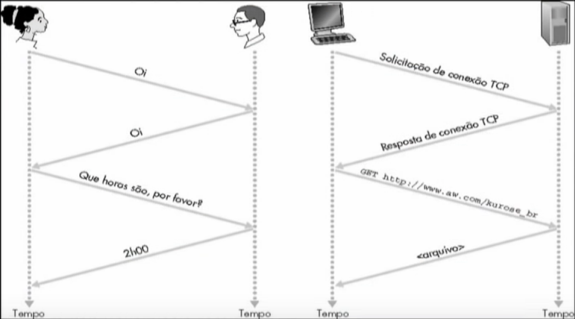

# Redes de computadores

Interligação de dois ou mais computadores e seus periféricos, com o objetivo de *comunicação*, *compartilhamento* e *intercâmbio* de recursos (como dados, arquivos, ...)

# Componentes

## Hardware

Computadores, smartphones, roteadores, switches, servidores, ...

## Software

TCP/IP, protocolos, e-mail, browser, ...

**Rede de computadores: conjunto de software e hardware**

# Internet

- Redes seria a "classe", e internet seria um "objeto", ou seja, a internet é uma implementação de uma rede.

- Elementos de computação interligados

- Enlaces (meios) de comunicação (fibra, rádio, satélite, ...)

# Protocolo

- Protocolo humano: que horas são? apresentações, ações tomadas...
- Protocolos de redes: toda atividade de comunicação da internet é governada por protocolos

## Definem regras que
- Estabelecem os formatos e a ordem das mensagens
- As ações a serem tomadas na transmissão e recepção das mensagens.



"Fala Erick"
"Fala Neidgel, beleza"
"beleza"
"...."


# Estrutura da Rede

## Borda da Rede

- aplicações e hospedeiros

### Tipos de serviços:

- Orientados à conexão (ex: telefonemas) - ex: TCP

- Sem conexão (ex: correspondência) - ex: UDP

Aplicações usando TCP: HTTP (Web), FTP (file transfer), SMTP (email), ...

- tem confirmação

Aplicações usando UDP: streaming media, teleconferência, telefonia IP, ...

- Software mais robusto fica na borda - google chrome não roda no núcleo

## Núcleo da Rede

- roteadores e rede de redes

"Servem para conectar um ponto a outro"

- múltiplos roteadores interconectados

### Formas de transferir dados na rede:

- Comutação de circuitos (usa um canal para cada conexão) - usa um canal dedicado desde o começo - ex: dirigir com uma rota fixa, definida no começo. Pode ser feita com FDM (frequência) e TDM (tempo).
*  * **Vantagens**: exclusividade, garante serviço
*  * **Desvantagens**: pode ser que alguém esteja reservando e não usando

- Comutação de pacotes (dados são enviados em "blocos" discretos) - ex: dirigir com mudança de rotas dinamicamente
*  * Cada fluxo é dividido em pacotes (cada pacote toma uma rota menos congestionada)
*  * **Vantagens**: pouco desperdício
*  * **Desvantagens**: alguns serviços podem ficar unitilizáveis

### Roteamento

#### Redes datagrama

- Endereço de destino determina o próximo salto
- Rotas podem mudar durante uma sessão
- Analogia: dirigir perguntando o caminho

#### Rede de circuitos virtuais

- Cada pacote leva um número (virtual circuit ID), o número determina o próximo salto
- O caminho é fixo e escolhido no instante de estabelecimento da conexão, permanece fixo durante toda a conexão.
- Analogia: dirigir já sabendo a rota

<!-- Aula 2 -->

# Atrasos e perdas na Internet

- Filas de pacotes em buffers de roteadores (atraso)

- Taxa de chegada de pacotes ao link ultrapassa a capacidade do link de saída (perda)

- Fila de pacotes esperam por sua vez (atraso)

## Formas de atraso de pacotes

- Processamento nos nós:
  - Verifica erros de bit
  - Determina link de saída

- Enfileiramento
  - Tempo de espera no link de saída para transmissão
  - Depende do nível de congestionamento do roteador
  
- Atraso de transmissão
  - Tempo para "empurrar"/colocar todos oos pacotes no link/enlace de transmissão
  - Tempo = Tamanho do Pacote (bits) / Largura de banda do link (bps)

- Atraso de propagação:
  - Atraso de propagação = comprimento do link físico / velocidade de propagação no meio (2x10^8 m/s)
  - Tempo para o pacote transitar no enlace

- Fontes de atrasos de pacotes: soma de todos esses atrasos 

# Camadas de Protocolos
- Redes são complexas
- Muitos componentes (hospedeiros, roteadores, enlaces, aplicações, protocolos, hardware, software, ...)
- Por isso, abordagem em camadas = dividir o trabalho em partes pequenas
  - modularização
- Ideia básica: cada etapa depende da anterior, mas não é necessário entender a anterior

## Modelo ISO/OSI
Padrão, não implementação. Camadas:

- Aplicação
- Apresentação
- Sessão
- Transporte
- Rede
- Enlace
- Física

### Encapsulamento de dados
- Cada pacote transita entre as camadas

### Camada Física
- Transmissão de sequêncas de bits pelo meio físico
- Padrões mecânicos, funcionais, elétricos e procedimentos para acesso ao meio físico
- Tipos de conexão:
  - Ponto-a-ponto ou multiponto,  full ou half-duplex, serial ou paralela

### Camada de Enlace
- Delimitação de quadro (quanto é o tamanho máximo do pacote para transitar)
- Detecção/recuperação de errors

### Camada de Rede
- Roteamento, por rotas fixas ou dinâmicas

### Camada de Transporte
- Assegura confiabilidade entre origem e destino
- Primeira camada que estabelece a comunicação origem-destino

### Camada de Sessão
- Gerencia Sessõoes de comunicação
  - Sessão: comunicação que necessita armazenar estados (ex: quem envia agora?)
- Estados são armazenados para permitir re-estabelecimento da comunicação

### Camada de Apresentação
- Trata de apresentar e traduzir os formatos dos dados
- Compressão, descompressão, segurança...

### Camada de Aplicação
- Trata de protocolos que suportam as diferentes aplicações, como email, browser, terminal virtual...

## Modelo ISO/OSI versus TCP/IP
Classe vs Objeto
- Aplicação (FTP, SMTP, HTTP)
- Transporte (TCP/UDP)
- Rede (IP, protocolos de roteamento)
- Acesso ao meio (Wi-fi, Ethernet, IEEE 802.15.4)

## Camadas da Internet
Internet
                ; pacote:
- Aplicação     ; mensagem
- Transporte    ; segmento
- Rede          ; datagrama
- Enlace        ; quadro/frame 	        software ^
- Física                                hardware

# Miscelânea

- ```netstat -o```

- onde colocar confiabilidade no UDP? Resposta: camada de aplicação

- complexidade maior: borda da rede; roteador não tem browser

#### Questões

- Quantas conexões são possíveis de serem implementadas em uma comutação de circuitos de f canais e t slots? **f * t**

- o que é melhor pro youtube: datagrama ou circuito virtual? **CV**; e pra FTP? **datagrama**. pro youtube, vale mais a pena alocar um tubinho fino constante; enquanto o FTP só precisa que baixe o mais rápido possível, indo de tubão em tubão.

- diga outras implementações da OSI: **ZigBee e bluetooth; camadas do zigbee: aplicação, redes, MAC e PHY**

- por que camadas? **a rede é complexa; modularização facilita alterações e manutenção, por exemplo; pq é pior: aumenta o tempo de execução**

- onde a complexidade é maior: borda ou núcleo? **borda da rede; roteador não tem browser**

- por que a ATM e o WIMAX morreram? **ATM: cara, precisava trocar os equipamentos ethernet e tals; WIMAX: precisava trocar a antena, cara**

- caracterize os 4 atrasos: **processamento (determinação link de saída), enfileiramento (tempo de espera para transmissão), transmissão (tempo para empurrar os pacotes no link de transmissão) e propagação (tempo para transitar no enlace)**

- caracterize JITTER e Encapsulamento
