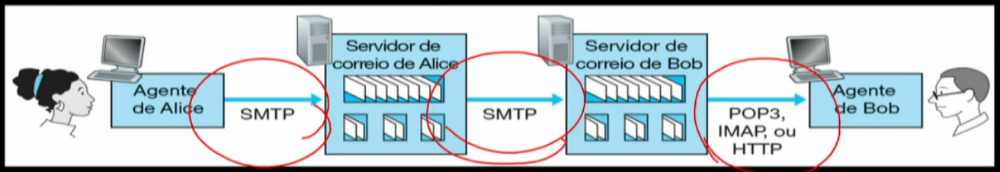
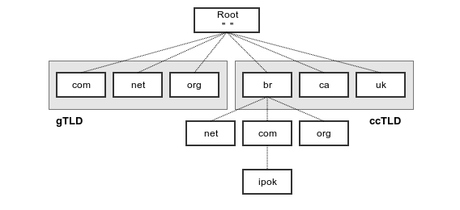

# Protocolos da Camada de Aplicação

## FTP - Transferência de arquivos

- Transporta arquivos entre sistemas de arquivo local e remoto

- Conexões de controle e dados
  - Controle TCP: *Porta 21*
    - Nome do arquivo, login name, senha, comandos (se vai do cliente pro servidor ou o contrário...)
      - Comandos mais comuns: USER username, PASS password, LIST, RETR filename (copia o arquivo remoto para o atual)
      - Respostas aos comandos
        - 331 (nome OK, password required); 125 (conexão de dados aberta, iniciando transferência); 452 (erro ao escrever o arquivo)
  - Dados TCP: *Porta 20*
    - Transporta o arquivo propriamente dito

## Email - Correio Eletrônico

- Três componentes
  - Agentes de usuário (próprios browsers, aplicativos gerenciadores de email, ...)
  - Servidores (locais que recebem email, ou que enviam email, ...)
  - Protocolos (SMTP, POP, IMAP, HTTP)



### Protocolo SMTP

- Single Message Transfer Protocol
- Usa TCP (orientado a conexão), pois garante confiabilidade
- Servidor ouve na porta 25
- Conexões persistentes
- Transferência direta (servidor que envia para o servidor que recebe)
- Agentes de usuário usam SMTP para enviar mensagens para o seu servidor (entre o servidor do remetente para o servidor do destinatário)


### Formato de mensagem de correio
```
From: jorge@abc.fr
To: tandy@def.aa
Subject: Aviso importante

Corpo da mensagem uuu
```

- Dá pra testar com telnet serverName 25

## DNS - Diretório da Internet

- Identificar um hospedeiros: um nome e um indereço IP
- Ou seja, transforma tipo: www.uol.com em um IP, desse jeito fica mais fácil de memorizar e tals
- DNS é um banco de dados distribuído executado em uma hierarquia de servidores de DNS, e um protocolo de camada de aplicação que permite que hospedeiros consultem esse BD
- Provê
  - Apelidos (alias) de hospedeiros
  - Apelidos de servidor de correio
  - Distribuição/balanceamento de carga



- Acesso é feito de:
  - forma interativa
    - Vão perguntando de servidor em servidor até receber o mapeamento
  - forma recursiva
    - vão enviando de forma recursiva

### Registros e mensagens DNS

- Tupla (Name, Value, Type, TTL) (www.uol.com.br, 127.129.2.2, A, time to leave)

## Aplicações P2P

- Cada par pode redistribuir qualquer parte do arquivo
- Um servidor (pode servir como catálogo, por exemplo) e vários hospedeiros

### Distributed Hash Table (DHTs)

- Banco de dados distribuído que guardará os pares (chave, valor) dos pares P2P
- Cria uma topologia com todos os nós disponíveis para permutar par-a-par
- No bittorrent, tem um servidor *rastreador* que visualiza os vértices disponíveis para mandar os arquivos

# Miscelânea

- SMTP é push, HTTP é pull
- Checksum: se tiver carry, tem q somar ele de novo e dps pegar o complemento de 1
