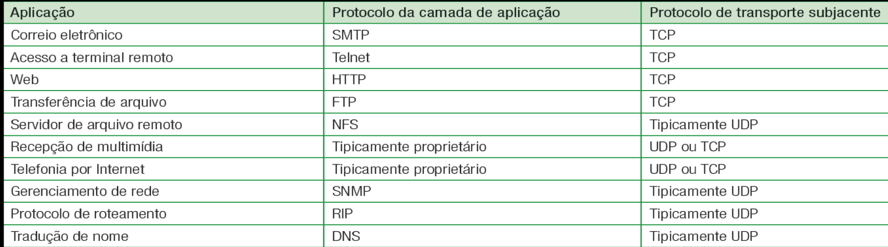
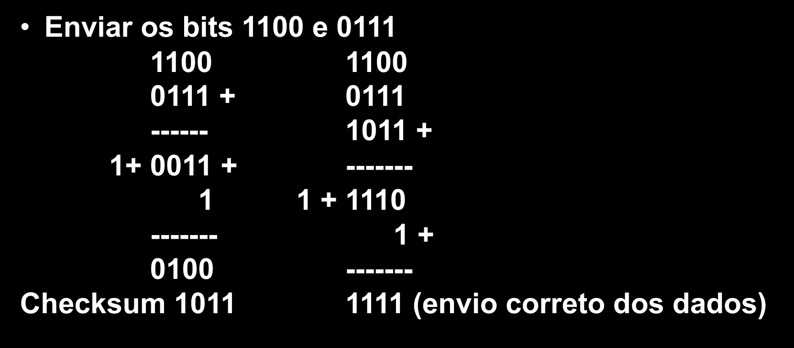

# Protocolo confiável e não confiável: TCP e UDP

## UDP

- Connectionless (não orientado a conexão)
- Simples (rápido)
- Não provê garantia para as camadas superiores
- Não adiciona nada ao IP (só umas multiplexações e verificações de erro simples)
- Se usar UDP, a aplicação estará "falando" quase diretamente com o IP
- Para prover segurança, precisa implementar na camada superior (aplicação)
- Recepção de multimídia, telefonia (VOIP), gerenciamento de redes, games...

### Estrutura

- Número da porta de origem (opcional), porta destino, checksum (opcional), comprimento, mensagem

**Checksum**: 

## Transporte orientado a conexão

- Checksum
- Timer (timeouts)
- Número de sequência (numeração sequencial dos pacotes) - paralelismo no envio

### Na camada de transporte
- Reconhecimento (avisar o remetente, ACK(n)), em que *n* é o número de sequẽncia
- Reconhecimento negativo (NACK(n))
- Janela, paralelismo (não floodar, então só pode enviar pacotes dentro de uma janela, faixa do número da sequência)

## TCP
- Orientado a conexão
- Full-duplex (ambos os sentidos)
- Processo a processo
- Uma vez estabelecido o TCP os processos podem se comunicar

### Estrutura
- Porta de origem, destino, nro de sequencia, nro reconhecimento do pacote, cabeçalho, janela de recepção, ...
- Número de sequência: primeiro byte do segmento
- Número de reconhecimento: primeiro byte que tá esperando do outro lado
  - Dessa forma, dá pra saber até qual byte ele recebeu

