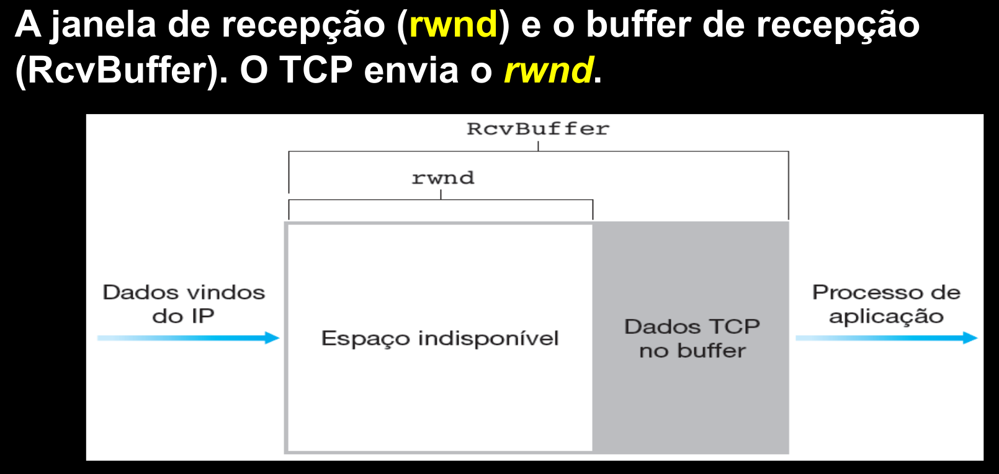

# Controle de Fluxo

- Buffer
- Remetente envia segmentos pro destinatário
  - Se o buffer tá cheio, precisa esperar -> nod ready, red flag
  - Se o buffer tá OK, pode continuar -> ready, sinal verde
- Controle fim a fim do buffer do destinatário
- Três vias (alô, posso falar, bora) -> nisso tem um buffer controlado pelo controle de buffer

### Produtor e consumidor
- Produtor produz item e envia no buffer, o consumidor vai consumindo enquanto precisar

# No TCP

- Tem um controle de fluxo para não estourar o buffer do destinatário
- Serviço de compatibilização de velocidades
- O TCP mantém uma variável denominada janela de recepção
  - Altera de acordo com a velocidade do consumo
  

- Aí ou pare e espere ou envia vários segmentos (paralelismo)

### Pare e Espere
- Um segmento de cada vez
- Próximo só é enviado depois de seu reconhecimento
- RTT é o tempo de ir e voltar, L/R é o tempo de enviar o pacote
- Pode degradar bastante o tempo, demora muito

### Paralelismo no envio
- Envia vários pacotes em pararelo antes de reconhecer um a um
- Reconhece todos de uma vez
- Aumenta throughput

#### Reconhecimento de pacotes paralelos: Go-Back-N
- Envia N pacotes sem esperar um a um
- Limitado a N pacotes não reconhecidos
- Sliding Window dos pacotes
- Go-Back-N tem um temporizador
  - Se der ruim no temporizador, recomeça a partir do que deu ruim, mesmo que os posteriores tenham dado bom
  
#### Repetição Seletiva (SR)
- No seletivo, não descarta os pacotes que foram e deram certo, mas algum depois deu ruim
- Mas tem complexidade a mais nos pacotes recebidos

# Handshake de 3 vias do TCP
- Alô
- Pode falar
- Manda

