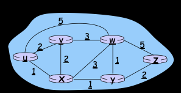

# Protocolos de Roteamento

- Abstração de grafo para representar a topologia
- Vértices: roteadores, arestas: enlaces

- Caminho mínimo

### Global vs Descentralizado
- Global: topologia completa, cada roteador faz o cálculo. Algoritmo de estado do enlace.
- Descentralizada: roteador conhece vizinhos adjacentes, cálculo iterativo com vizinhos. Algoritmo de vetor de distância.

### Estático vs Dinâmico
- Estático: rotas mudam lentamente
- Dinâmica: rotas mudam mais rapidamente, atualização periódica

### Algoritmo de roteamento de estado de enlace
- Dijkstra
- Forma a árvore mínima a partir de *u*.

### Algoritmo de vetor de distância
- Itreativo, assíncrono e distribuído
- Cada nó notifica vizinhos apenas quando seu DV muda
- De vizinho pra vizinho, cada um recalcula suas estimativas e propaga pros vizinhos

### Comparação
- Distance vector (RIP, BGP)
  - cada roteador envia a tabela para o vizinho
  - envia updates periódicos a cada 30~90 segundos
  - custo do enlace baseado no # de hops
- Link state (OSPF)
  - Updates enviados para toda a rede (broadcast)
  - Cada nó possui conhecimento
 
 
## Roteamento hierárquico
- Até aqui: roteadores idênticos, rede "achatada", não acontece na prática
- Autonomia administrativa: internet -> rede de redes, cada administrador pode controlar o roteamento em sua própria rede
- Todos os roteadores dentro do mesmo AS (algoritmo de roteamento) rodam o mesmo algoritmo de roteamento
- Dispõe das informações sore cada um dos outros
- Algoritmos intrassistemas e intersistemas
